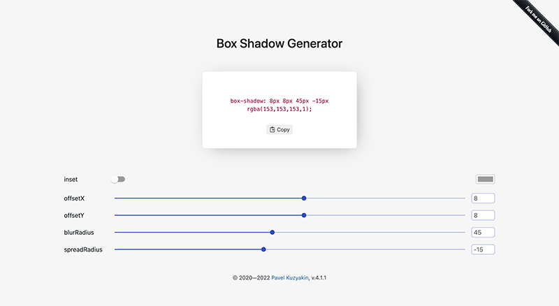

# Box Shadow Generator
   

## [boxshadow.vercel.app](https://boxshadow.vercel.app/)

A box-shadow CSS generator that helps you quickly generate box-shadow CSS declarations for your website. Preview the result and copy the generated code to your website. No coding required!

Made for myself, usually at night with an incredible amount of ☕.

## License

This project is open source and available under the [MIT License](LICENSE).
